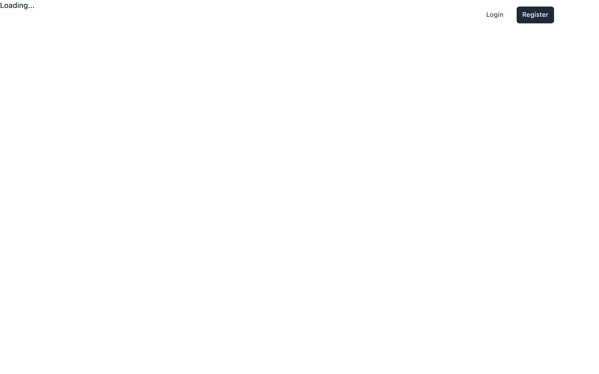
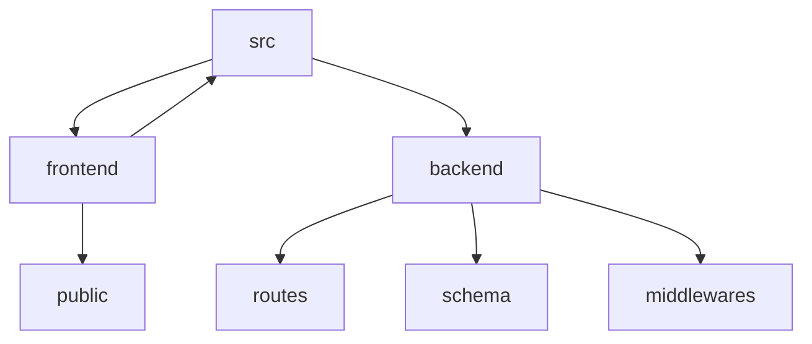

# Notify-AS: A Full-Stack Notification and Task Management Application


## 🗂️ Description

Notify-AS is a comprehensive full-stack application designed to manage notifications, tasks, notes, and posts. It provides a robust platform for users to create, read, update, and delete various items, ensuring seamless interaction and organization. The application is built with a modern tech stack, focusing on scalability, performance, and user experience. It's ideal for developers and teams looking for an efficient way to manage their tasks and communications.

## ✨ Key Features

### **User Management**
- User registration and login functionality
- User profile management
- Authentication and authorization using JSON Web Tokens (JWT)

### **Task Management**
- Create, read, update, and delete tasks
- Toggle task completion status

### **Note Management**
- Create, read, update, and delete notes

### **Post Management**
- Create, read, update, and delete posts

### **Frontend**
- Built with React, Vite, and Tailwind CSS for a responsive UI
- Client-side routing and protected routes

### **Backend**
- Built with Node.js and Express.js
- RESTful API for data manipulation and retrieval
- MongoDB for data storage

## 🗂️ Folder Structure



## 🛠️ Tech Stack


## ⚙️ Setup Instructions

### Prerequisites
- Git
- Docker
- Docker Compose

### Steps
1. **Clone the Repository**
   ```bash
   git clone https://github.com/oneWritesCode/notify-as.git
   ```
2. **Navigate to the Project Directory**
   ```bash
   cd notify-as
   ```
3. **Build and Run with Docker Compose**
   ```bash
   docker-compose up --build
   ```
4. **Access the Application**
   - Frontend: http://localhost:5173
   - Backend: http://localhost:3000

## 📁 API Endpoints

The backend API is documented in the code and can be explored using tools like Postman or Swagger.

## 🚀 GitHub Actions

This project utilizes GitHub Actions for continuous integration and deployment. Workflows are set up to automatically build and deploy the application to a cloud platform upon push events to the main branch.

## 📝 DEPLOYMENT

For detailed deployment instructions, refer to the [DEPLOYMENT.md](DEPLOYMENT.md) file. It covers prerequisites, environment variables, and deployment options, including manual, Docker, and cloud deployments.


<br><br>
<div align="center">

<h3>deepak</h3>
<p>Passionate developer striving for excellence in code.</p>
</div>
<br>
<p align="right">
  <a href="https://gitfull.vercel.app">Made by GitFull</a>
</p>
    